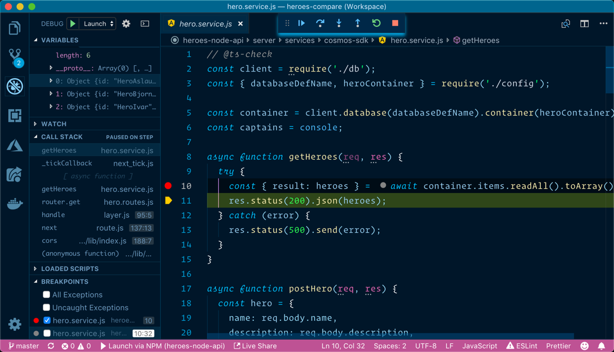
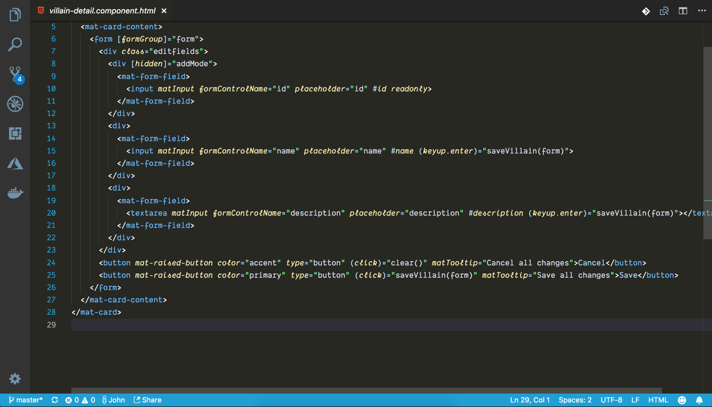
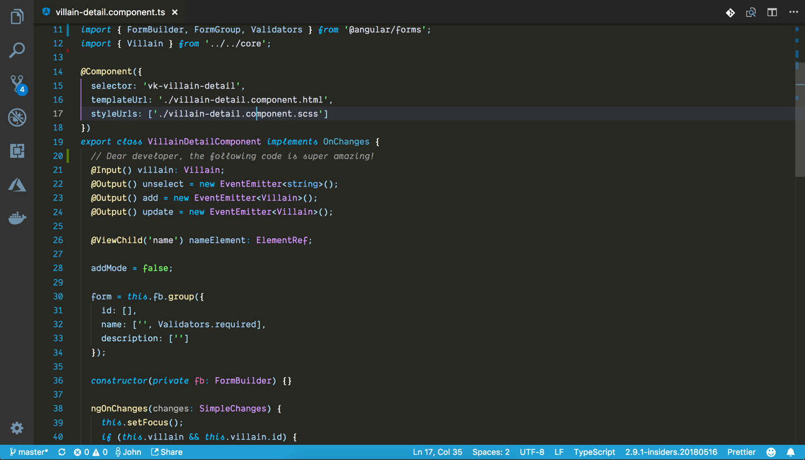
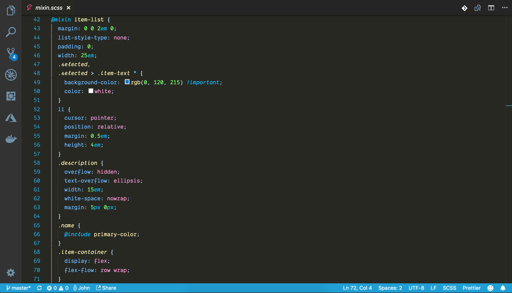
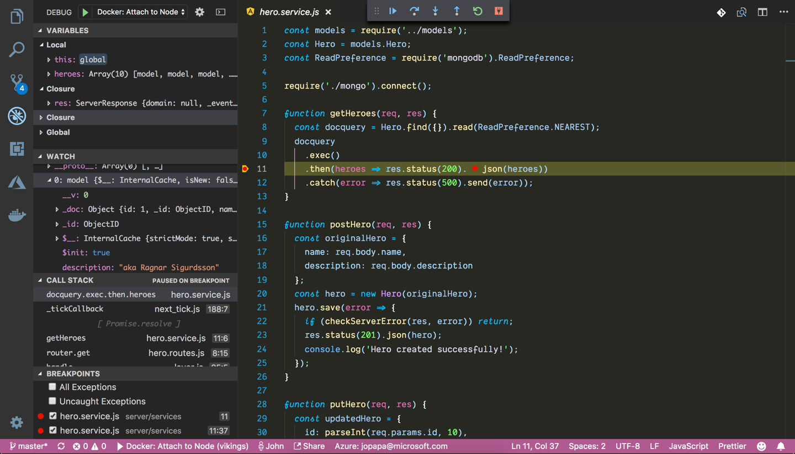

# Winter is Coming theme for VS Code

This extension for Visual Studio Code adds two themes titled "Winter is Coming". There are dark, dark blue, and light themes.


> I personally use the dark themes for most occasions, but find the light theme good on some dimmer projectors when I present.

See the [CHANGELOG](CHANGELOG.md) for the latest changes.

## Dark Blue Theme




The dark blue theme is best seen with a font that supports cursive italicized fonts

## Dark Theme









The dark theme is best seen with a font that supports cursive italicized fonts

## Light Theme


## Usage

Select the theme and go!

## Installation

1. Open **Extensions** sidebar panel in VS Code. `View → Extensions`
1. Search for `Winter is Coming`
1. Click **Install**
1. Click **Reload**
1. File > Preferences > Color Theme > **Winter is Coming (Dark)**
1. Optional: Use the recommended settings below for best experience

## Recommended Settings

```js
{
	"editor.autoIndent": true,
	"editor.codeLens": false,
	"editor.cursorBlinking": "smooth",
	"editor.cursorStyle": "line",
	"editor.fontSize": 14,
	"editor.fontFamily": "Dank Mono, Operator Mono, Fira Code",
	"editor.fontLigatures": true,
	"editor.formatOnPaste": true,
	"editor.formatOnType": true,
	"editor.formatOnSave": true,
	"editor.minimap.enabled": false,
	"editor.renderWhitespace": "none",
	"editor.tabCompletion": true,
	"editor.wordWrap": "off",
	"explorer.confirmDragAndDrop": false,
	"explorer.openEditors.visible": 0,
 	"files.autoSave": "afterDelay",
	"files.autoSaveDelay": 1000,
	"files.exclude": {
		"**/*.js": {
			"when": "$(basename).ts"
		},
		"**/*.js.map": {
			"when": "$(basename)"
		}
	},
	"files.hotExit": "onExit",
	"files.defaultLanguage": "typescript",
	"files.trimTrailingWhitespace": true,
	"prettier.printWidth": 100,
	"prettier.singleQuote": true,
	"prettier.tabWidth": 2,
	"window.zoomLevel": 0,
	"workbench.colorTheme": "Winter is Coming (Dark)",
	"zenMode.centerLayout": false
}
```

## Extra Customizations (Optional)

Some styles in VS Code aren't controlled by the `settings.json`.

1. install [`Custom CSS and JS Loader` extension](https://marketplace.visualstudio.com/items?itemName=be5invis.vscode-custom-css)
1. Create a file on your computer to hold your custom CSS named `~/.vscodestyles.css`
1. Copy everything in [`.custom-vscodestyles.css`](./.custom-vscodestyles.css) into your file
1. Point your `settings.json` to the file you just created
   ```json
     "vscode_custom_css.imports": [
       "/Volumes/Macintosh HD/Users/yourname/.vscodestyles.css"
     ]
   ```
1. Open your command palette
1. Select `enable custom CSS and JS`
1. Reload VS Code


## Fonts

I am using a paid font titled `Dank Mono`. (e.g. `Operator Mono` is also a paid font that is awesome). If you do not have these fonts, use your favorite font. Fira Code is a free one that works well too.

## Feedback

If you have suggestions, please [open an issue](https://github.com/johnpapa/vscode-winteriscoming/issues) or better yet, a [pull request](https://github.com/johnpapa/vscode-winteriscoming/pulls).

Be nice.

## Credits

Credit where credit is due ... this theme was inspired by the themes Visual Studio Dark+, Monokai and [Dustin Sander's theme for "An Old Hope"](https://marketplace.visualstudio.com/items?itemName=dustinsanders.an-old-hope-theme-vscode). Custom CSS inspired by [Wes Bos](https://twitter.com/wesbos). Blue background for the Dark Blue them inspired by [Sarah Drasner](https://twitter.com/sarah_edo)'s [Night Owl theme](https://marketplace.visualstudio.com/items?itemName=sdras.night-owl)

## Authors

Authored by [John Papa](https://twitter.com/john_papa)

Light theme co-authored by [Brian Clark](https://twitter.com/_clarkio)
