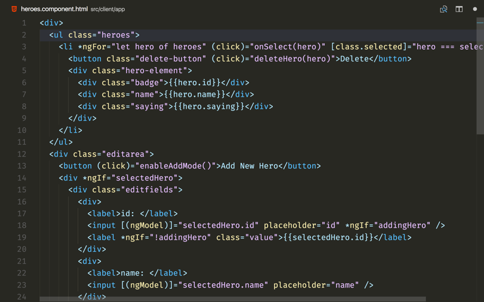
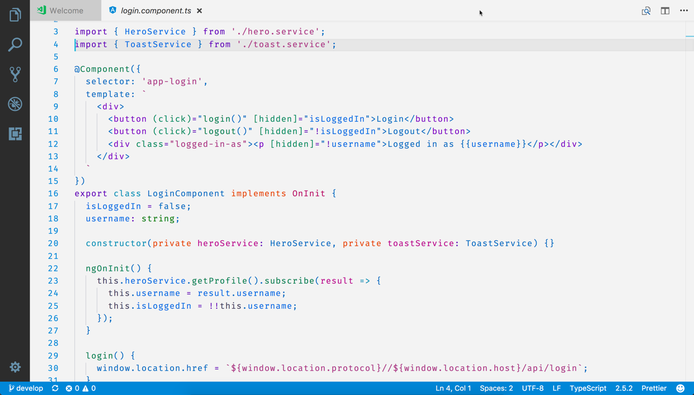
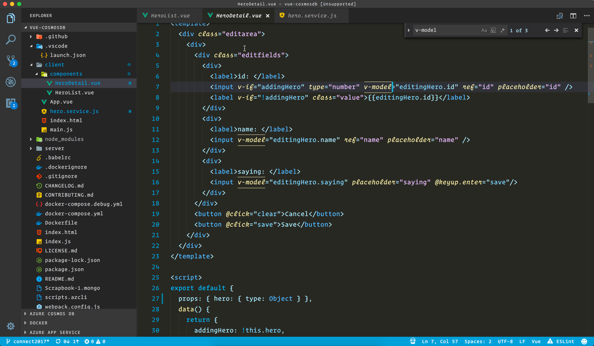

# Winter is Coming theme for VS Code

This extension for Visual Studio Code adds two themes titled "Winter is Coming". There are both dark and light themes.

I personally use the dark theme for most occasions, but find the light theme good on some dimmer projectors when I present.

See the [CHANGELOG](CHANGELOG.md) for the latest changes.

## Dark Theme




## Light Theme



## Usage

Select the theme and go!

## Installation

1. Open **Extensions** sidebar panel in VS Code. `View → Extensions`
1. Search for `Winter is Coming`
1. Click **Install**
1. Click **Reload**
1. File > Preferences > Color Theme > **Winter is Coming**
1. Optional: Use the recommended settings below for best experience

## Recommended Settings

```js
{
  "editor.cursorBlinking": "solid",
  "editor.cursorStyle": "underline-thin",
  "editor.fontSize": 16,
  "editor.lineHeight": 25,
  "editor.fontFamily": "Operator Mono, Fira code, Inconsolata, Monofur, Menlo",
  "editor.formatOnType": true,
  "editor.letterSpacing": 0.5,
  "editor.tabSize": 2,
  "editor.wordWrap": "off",
  "files.autoSave": "afterDelay",
  "files.autoSaveDelay": 1000,
  "files.hotExit": "onExit",
  "files.trimTrailingWhitespace": true,
  "prettier.printWidth": 100,
  "prettier.singleQuote": true,
  "prettier.tabWidth": 2,
  "window.zoomLevel": 0,
  "workbench.colorTheme": "Winter is Coming (Dark)"
}
```

## Extra Customizations (Optional)

Some styles in VS Code aren't controlled by the `settings.json`.

1. install [`Custom CSS and JS Loader` extension](https://marketplace.visualstudio.com/items?itemName=be5invis.vscode-custom-css)
1. Create a file on your computer to hold your custom CSS named `~/.vscodestyles.css`
1. Copy everything in [`.custom-vscodestyles.css`](./.custom-vscodestyles.css) into your file
1. Open your command palette
1. Select `enable custom CSS and JS`
1. Reload VS Code



## Fonts

I am using a paid font titled `Operator Mono`. If you do not have that font, the settings above will move along to Fira Code or Inconsolata, until it finds an installed font.

## Feedback

If you have suggestions, please [open an issue](https://github.com/johnpapa/vscode-winteriscoming/issues) or better yet, a [pull request](https://github.com/johnpapa/vscode-winteriscoming/pulls).

Be nice.

## Credits

Credit where credit is due ... this theme was inspired by the themes Visual Studio Dark+, Monokai and [Dustin Sander's theme for "An Old Hope"](https://marketplace.visualstudio.com/items?itemName=dustinsanders.an-old-hope-theme-vscode). Custom CSS inspired by [Wes Bos](https://twitter.com/wesbos).

## Authors

Authored by [John Papa](https://twitter.com/john_papa)

Light theme co-authored by [Brian Clark](https://twitter.com/_clarkio)
