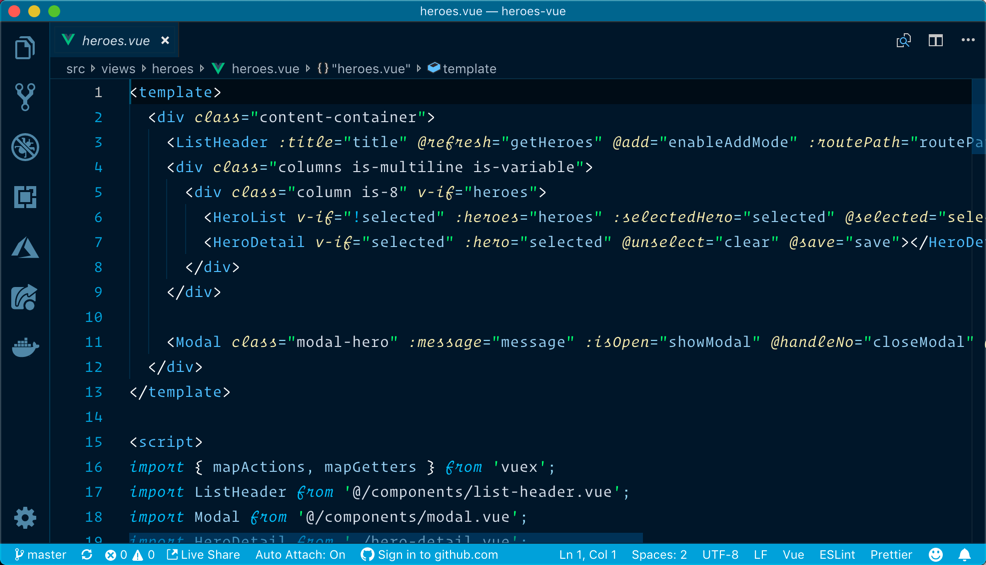
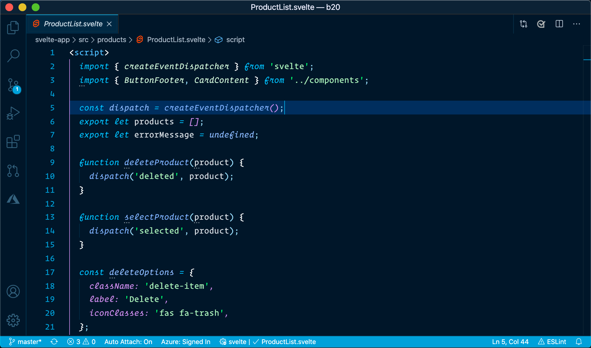
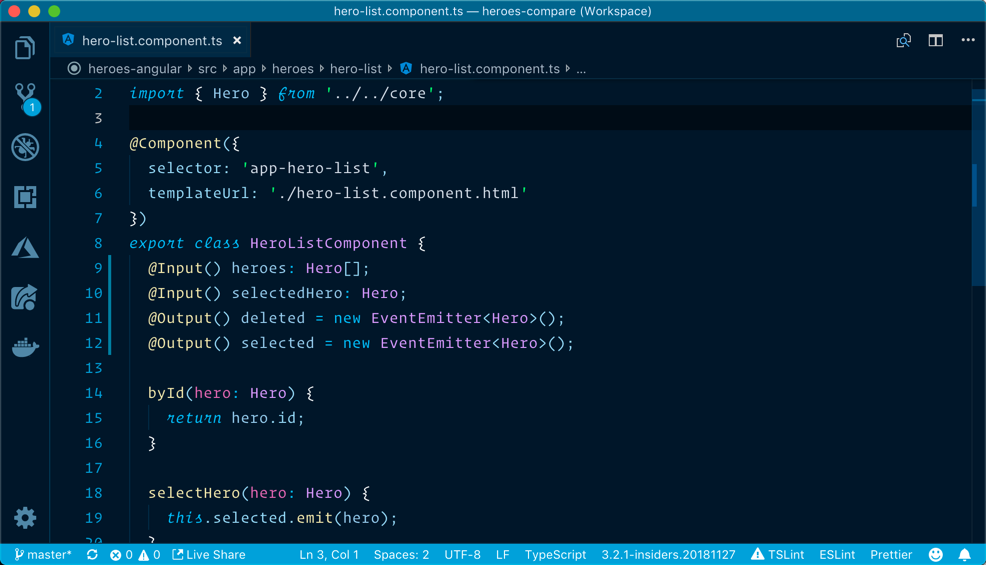
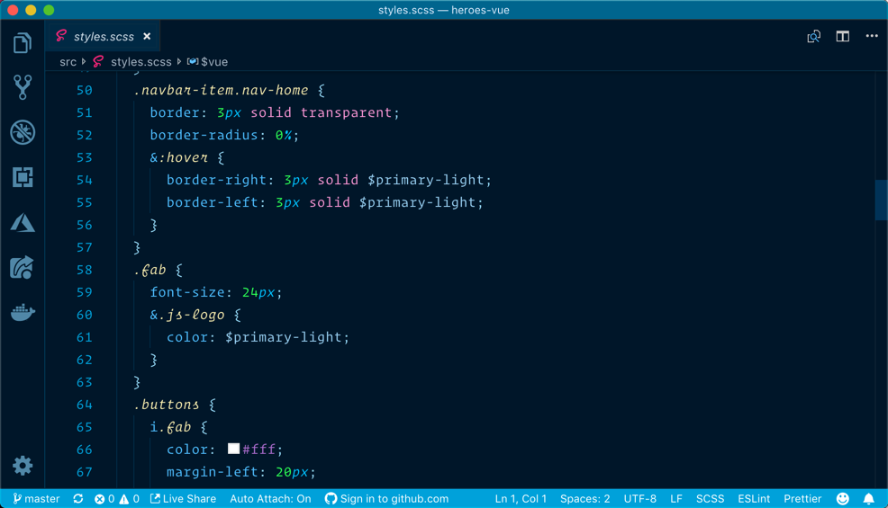
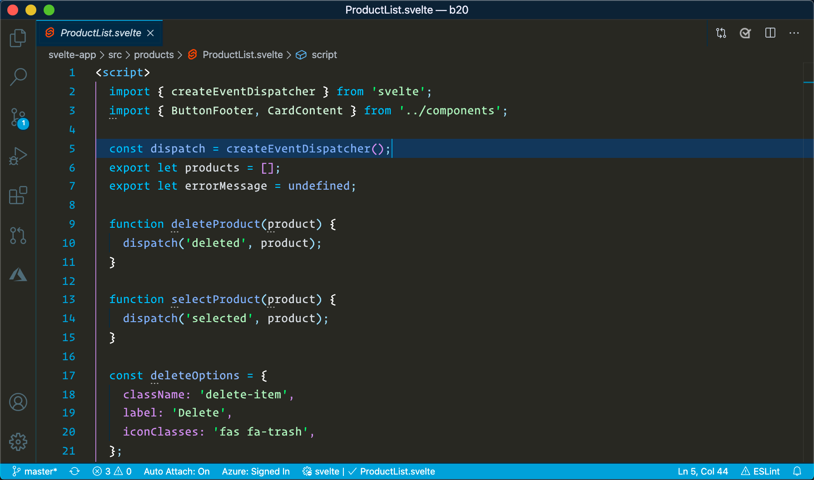
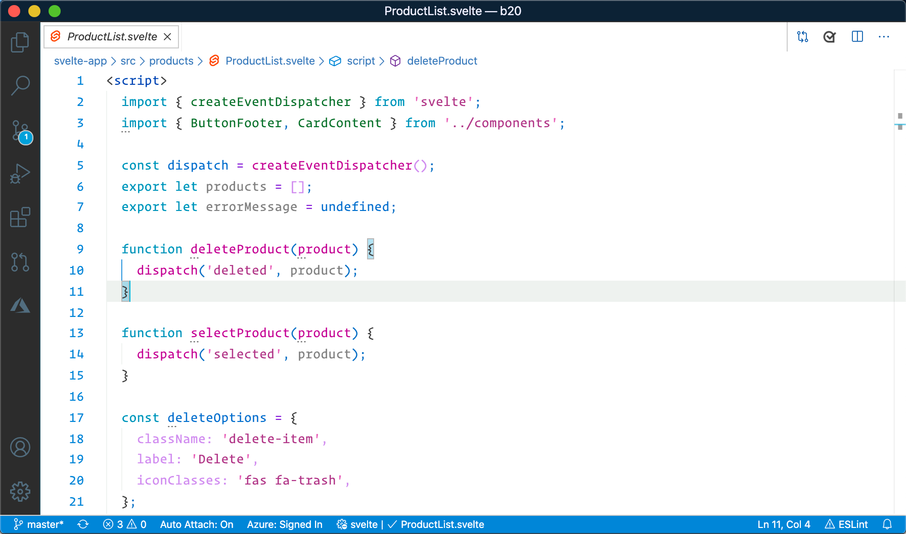

# Winter is Coming

This extension for Visual Studio Code adds themes titled "Winter is Coming". There are dark, dark with no italics, and light themes.

> I personally use the dark themes for most occasions, but find the light theme good on some dimmer projectors when I present.

See the [CHANGELOG](CHANGELOG.md) for the latest changes.

The themes also support an italicized version, with fonts that supports cursive italicized fonts.

## Dark Blue Theme

**Dark Blue HTML**


**Dark Blue JavaScript**


**Dark Blue TypeScript**


**Dark Blue SCSS**


## Dark Black Theme

**Dark Black JavaScript**


## Light Theme

**Light JavaScript**


## Usage

Select the theme and go!

## Installation

1. Open **Extensions** sidebar panel in Visual Studio Code. `View → Extensions`
1. Search for `Winter is Coming`
1. Click **Install**
1. Click **Reload**
1. File > Preferences > Color Theme > **Winter is Coming (Dark Blue)**
1. Optional: Use the recommended settings below for best experience

## Recommended Settings

```js
{
  "editor.autoIndent": "full",
  "editor.cursorBlinking": "solid",
  "editor.cursorSmoothCaretAnimation": true,
  "editor.cursorStyle": "line",
  "editor.fontSize": 16,
  "editor.fontFamily": "Dank Mono, Fira Code, Inconsolata",
  "editor.fontLigatures": true,
  "editor.formatOnPaste": true,
  "editor.formatOnType": false,
  "editor.formatOnSave": true,
  "editor.letterSpacing": 0.3,
  "editor.lineHeight": 25,
  "editor.minimap.enabled": false,
  "editor.multiCursorModifier": "ctrlCmd",
  "editor.suggestSelection": "first",
  "editor.tabCompletion": "on",
  "editor.tabSize": 2,
  "editor.wordWrap": "on",
  "files.autoSave": "afterDelay",
  "files.autoSaveDelay": 1000,
  "search.showLineNumbers": true,
  "workbench.iconTheme": "material-icon-theme",
  "workbench.colorCustomizations": {},
  "workbench.colorTheme": "Winter is Coming (Dark Blue)",
  "zenMode.centerLayout": false,
}
```

## Fonts

I am using a paid font titled **Dank Mono**. **Operator Mono** is also a paid font that is awesome. If you do not have these fonts, use your favorite font. **Fira Code** is a free one that works well too.

## Feedback

If you have suggestions, please [open an issue](https://github.com/johnpapa/vscode-winteriscoming/issues) or better yet, a [pull request](https://github.com/johnpapa/vscode-winteriscoming/pulls).

Be nice.

## Credits

Credit where credit is due ... this theme was inspired by the themes Visual Studio Dark+, Monokai and [Dustin Sander's theme for "An Old Hope"](https://marketplace.visualstudio.com/items?itemName=dustinsanders.an-old-hope-theme-vscode). Custom CSS inspired by [Wes Bos](https://twitter.com/wesbos). Blue background for the Dark them inspired by [Sarah Drasner](https://twitter.com/sarah_edo)'s [Night Owl theme](https://marketplace.visualstudio.com/items?itemName=sdras.night-owl)

## Authors

Authored by [John Papa](https://twitter.com/john_papa)

Light theme co-authored by [Brian Clark](https://twitter.com/_clarkio)
