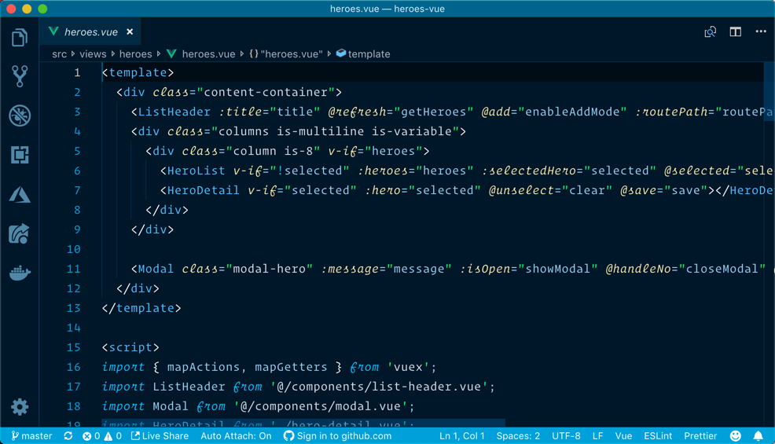
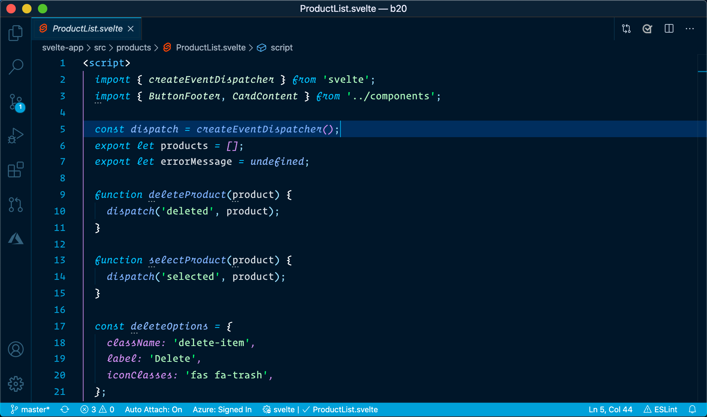
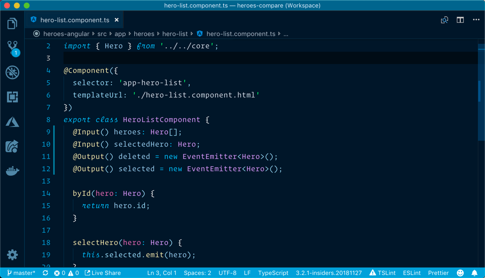
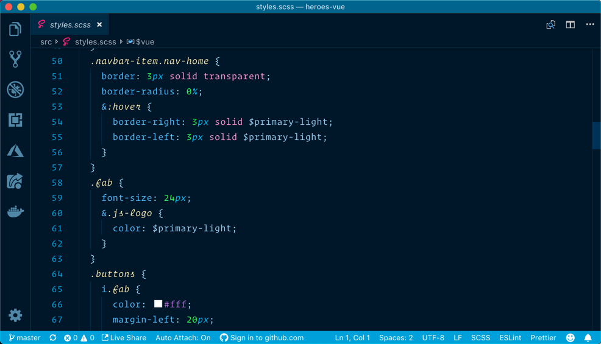
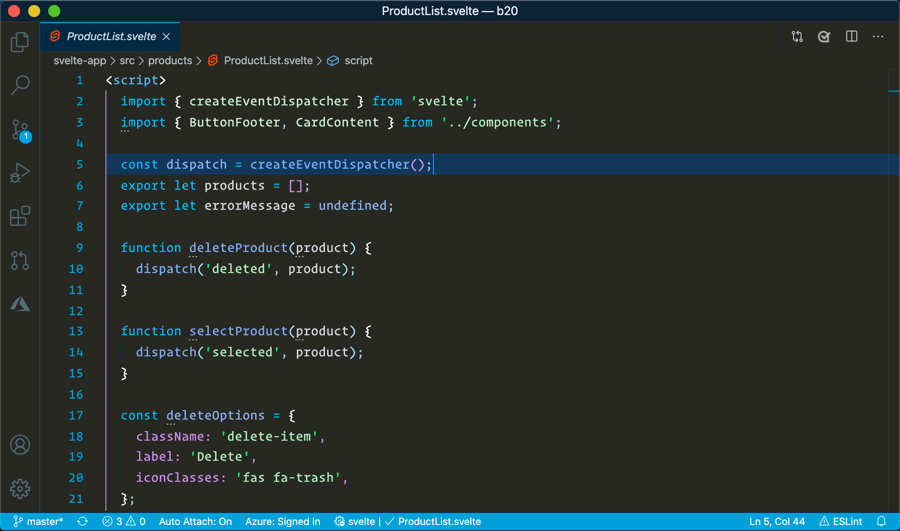
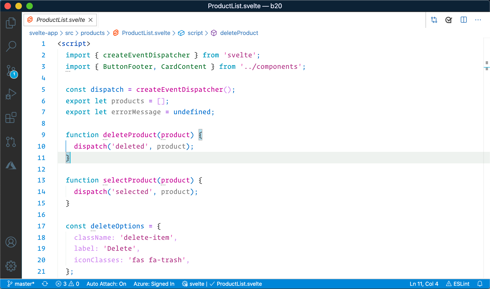

# Winter is Coming

[](https://github.com/johnpapa/ai-ready)

This Visual Studio Code extension adds six **Winter is Coming** theme variants:

- Winter is Coming (Dark Blue)
- Winter is Coming (Dark Blue - No Italics)
- Winter is Coming (Dark Black)
- Winter is Coming (Dark Black - No Italics)
- Winter is Coming (Light)
- Winter is Coming (Light - No Italics)

> I personally use the dark themes for most occasions, but find the light theme good on some dimmer projectors when I present.

See the [CHANGELOG](CHANGELOG.md) for the latest changes.

Each base theme also has a **No Italics** companion for anyone who prefers the same palette without italic token styling.

## Dark Blue Theme

**Dark Blue HTML**


**Dark Blue JavaScript**


**Dark Blue TypeScript**


**Dark Blue SCSS**


## Dark Black Theme

**Dark Black JavaScript**


## Light Theme

**Light JavaScript**


## Installation

1. Open **Extensions** sidebar panel in Visual Studio Code. `View → Extensions`
1. Search for `Winter is Coming`
1. Click **Install**
1. Click **Reload**
1. Open **File > Preferences > Color Theme**
1. Select your preferred **Winter is Coming** variant
1. Optional: Use the recommended settings below for best experience

## Notes

- If you want VS Code to theme the title bar and related chrome where supported, set `"window.titleBarStyle": "custom"`.
- The **No Italics** variants keep the same colors as their paired themes without any italic token rules.

## Recommended Settings

```jsonc
{
  "editor.autoIndent": "full",
  "editor.cursorBlinking": "solid",
  "editor.cursorSmoothCaretAnimation": true,
  "editor.cursorStyle": "line",
  "editor.fontSize": 16,
  "editor.fontFamily": "Dank Mono, Fira Code, Inconsolata",
  "editor.fontLigatures": true,
  "editor.formatOnPaste": true,
  "editor.formatOnType": false,
  "editor.formatOnSave": true,
  "editor.letterSpacing": 0.3,
  "editor.lineHeight": 25,
  "editor.minimap.enabled": false,
  "editor.multiCursorModifier": "ctrlCmd",
  "editor.suggestSelection": "first",
  "editor.tabCompletion": "on",
  "editor.tabSize": 2,
  "editor.wordWrap": "on",
  "files.autoSave": "afterDelay",
  "files.autoSaveDelay": 1000,
  "search.showLineNumbers": true,
  "workbench.iconTheme": "material-icon-theme",
  "workbench.colorTheme": "Winter is Coming (Dark Blue)",
  "window.titleBarStyle": "custom",
  "zenMode.centerLayout": false
}
```

## Fonts

I use **Dank Mono**. **Operator Mono** is another great paid option. If you do not have those fonts, use your favorite font; **Fira Code** is a solid free choice.

## Feedback

If you have suggestions, please [open an issue](https://github.com/johnpapa/vscode-winteriscoming/issues) or better yet, a [pull request](https://github.com/johnpapa/vscode-winteriscoming/pulls).

Be nice.

## Credits

Credit where credit is due: this theme was inspired by Visual Studio Dark+, Monokai, and [Dustin Sanders' "An Old Hope"](https://marketplace.visualstudio.com/items?itemName=dustinsanders.an-old-hope-theme-vscode&WT.mc_id=vscodewinteriscoming-github-jopapa). Custom CSS inspiration came from [Wes Bos](https://twitter.com/wesbos). The dark blue background was inspired by [Sarah Drasner](https://twitter.com/sarah_edo)'s [Night Owl theme](https://marketplace.visualstudio.com/items?itemName=sdras.night-owl&WT.mc_id=vscodewinteriscoming-github-jopapa).

## Authors

Authored by [John Papa](https://twitter.com/john_papa)

Light theme co-authored by [Brian Clark](https://twitter.com/_clarkio)

## Contributing

See [CONTRIBUTING.md](CONTRIBUTING.md) for guidelines on how to contribute, including setup, testing, and PR conventions.

For the full contributor guide (repo structure, theme conventions, how to add a new variant), see [AGENTS.md](AGENTS.md).
